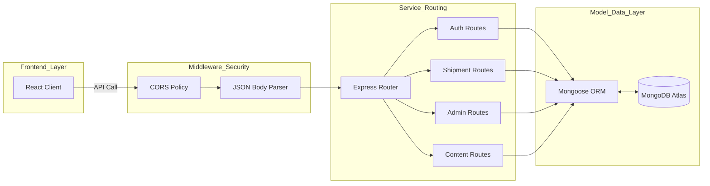

# E-Drop Backend Architecture Documentation

This document provides a comprehensive technical overview of the E-Drop backend infrastructure, designed for architectural review and supervisory audit.

## 1. Architectural Philosophy
The E-Drop backend is built on a **Modular Layered Architecture** using the **Node.js, Express, and MongoDB (Mongoose)** ecosystem. This design prioritizes:
- **Separation of Concerns**: Decoupling routing, business logic, and data persistence.
- **Scalability**: Stateless REST API design allowing for easy expansion.
- **Maintainability**: Clear file structure based on features (Auth, Shipments, Admin).

---

## 2. High-Level Backend Flow Diagram
The following diagram illustrates how a request (from the React Frontend) is processed through the backend layers:

---

## 3. Technology Stack & Role
- **Language**: JavaScript (Node.js Runtime)
- **Framework**: Express.js (HTTP Server & Routing)
- **Database**: MongoDB (NoSQL Database)
- **Object Modeling**: Mongoose (Schema definition & Validation)
- **Email Service**: Nodemailer (Transactional emails & OTPs)
- **Environment Management**: Dotenv (Secure configuration)

---

## 4. Layer-by-Layer Breakdown

### 4.1 Entry Point (`server.js`)
The `server.js` serves as the application's heartbeat. It handles:
- Initialization of the Express app.
- Configuration of global middlewares (CORS for cross-origin security, body-parser for data handling).
- Database connection lifecycle management.
- Dynamic route registration.

### 4.2 Routing Layer (`/routes`)
Each domain has its own dedicated router file (e.g., `shipmentRoutes.js`, `authRoutes.js`). This ensures that the code remains DRY (Don't Repeat Yourself) and easy to debug.
- **Endpoints**: Standardized RESTful patterns (`GET`, `POST`, `PATCH`, `DELETE`).
- **Access Control**: Specific routes (like `/api/admin`) carry secondary verification flags to ensure only authorized actors can access sensitive data.

### 4.3 Model Layer (`/models`)
This layer defines the "Blueprint" of the data using Mongoose schemas.
- **Data Validation**: Strict types (String, Number, Date, Object) and validation rules (Required, Unique).
- **Indexing**: Automatic indexing on fields like `trackingID` and `email` for high-performance retrieval.

### 4.4 Middleware & Services
- **CORS**: Configured to restrict or allow specific origins, protecting the API from unauthorized external domains.
- **Nodemailer Service**: A utility integration that allows the backend to talk to SMTP servers for real-time notifications (OTP, Support Replies).

---

## 5. Request-Response Cycle (Technical Example)
When a user tracks a shipment:
1. **Request**: Frontend sends `GET /api/shipments/track/:id`.
2. **Routing**: `server.js` directs it to `shipmentRoutes.js`.
3. **Logic**: The route handler uses the `Shipment` model to query MongoDB.
4. **Data Acquisition**: Mongoose fetches the document and converts it to a JSON object.
5. **Response**: The server sends the JSON back with a `200 OK` status.

---

## 6. Security Features
- **Environment Variables**: Sensitive keys (DB URI, Email Passwords) are never hardcoded and are managed via `.env`.
- **Validation**: Server-side checks ensure that invalid data doesn't reach the database.
- **Separation**: Frontend logic never directly touches the database; every call must pass through the Backend API.
