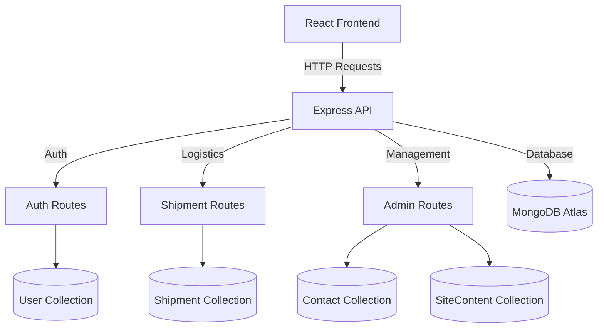
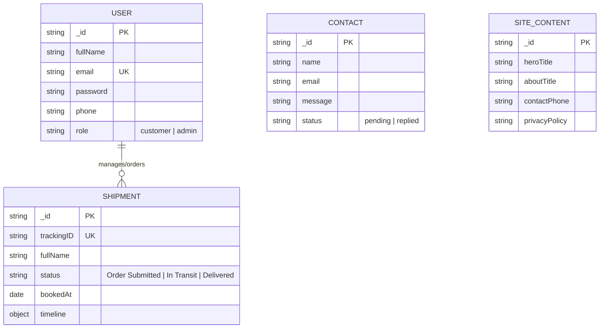

# E-Drop Backend Technical Documentation

## 1. Overview
The E-Drop Backend is a robust, scalable RESTful API built on the **MERN** stack (Node.js, Express, MongoDB). It handles core business logic for logistics, user authentication, content management, and administrative operations.

---

## 2. System Architecture
The backend follows a **Modular Layered Architecture**:
- **Entry Point**: `server.js` initializes the Express application, connects to MongoDB, and registers middleware.
- **Routing Layer**: Organized by domain (`/auth`, `/admin`, `/shipments`, etc.).
- **Model Layer**: Mongoose schemas defining the structure of MongoDB collections.
- **Middleware**: Custom logic for Admin authorization, CORS management, and JSON parsing.

---

## 3. Database Schema (ER Diagram)
The database uses MongoDB with Mongoose for object modeling. Below is the relationship mapping between key entities:

---

## 4. API Reference

### 4.1 Authentication (`/api/auth`)
| Endpoint | Method | Description | Access |
| :--- | :--- | :--- | :--- |
| `/signup` | POST | Registers a new user with fullName, email, phone, and role. | Public |
| `/login` | POST | Authenticates user via email/phone and returns user metadata. | Public |
| `/forgot-password` | POST | Generates and emails a 6-digit OTP for password recovery. | Public |
| `/verify-otp` | POST | Validates the OTP sent to user email. | Public |
| `/reset-password` | POST | Updates the user password after successful OTP verification. | Public |

### 4.2 Admin Services (`/api/admin`)
*All admin routes require `user-role: admin` in headers.*

| Endpoint | Method | Description |
| :--- | :--- | :--- |
| `/users` | GET | List all registered users (excluding passwords). |
| `/users/:id` | DELETE | Remove a user account. |
| `/shipments` | GET | Overview of all active and historical shipments. |
| `/shipments/:id/status`| PATCH | Update logistics status and trigger timeline updates. |
| `/messages` | GET | Fetch all contact inquiries. |
| `/reply` | POST | Send email response to user inquiry via Nodemailer. |

### 4.3 Shipments & Logistics (`/api/shipments`)
| Endpoint | Method | Description | Access |
| :--- | :--- | :--- | :--- |
| `/` | POST | Create a new shipment order. | Authenticated |
| `/track/:trackingID` | GET | Public tracking based on unique tracking ID. | Public |
| `/user-shipments/:email`| GET | List all shipments associated with a user email. | Authenticated |

---

## 5. Key Technical Features

### Role-Based Access Control (RBAC)
The system distinguishes between `customer` and `admin` roles. Admin-only functionality is protected by a custom middleware that validates the `user-role` header before processing requests.

### Real-Time Logistics Timeline
The `Shipment` model implements a dynamic `timeline` object. When an admin updates a shipment's status (e.g., to "Delivered"), the backend automatically timestamps the corresponding event in the database, allowing for accurate real-time tracking on the frontend.

### Transactional Emails
Integrates **Nodemailer** with SMTP (Gmail) to handle:
- OTP generation for password recovery.
- Professional support replies directly from the Admin Dashboard.

### Data Integrity
- **Unique Indexes**: Implemented on `email`, `phone`, and `trackingID` to prevent duplicate resource creation.
- **Input Sanitization**: Uses `toLowerCase()` and `trim()` on critical fields like email and names to ensure search consistency.

---

## 6. Environment Configuration
The backend relies on the following `.env` variables:
- `MONGO_URI`: MongoDB connection string.
- `PORT`: Server port (Default: 5000).
- `EMAIL_USER`: Support email address for automated notifications.
- `EMAIL_PASS`: App-specific password for the support email.
