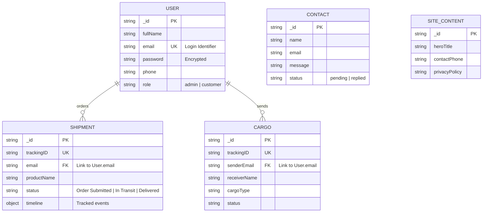

# E-Drop Database Schema & Relationships

This document outlines the MongoDB data structure for the E-Drop platform, detailing the collections, fields, and logical relationships between entities.

## 1. Entity-Relationship (ER) Diagram
The diagram below shows how different collections interact. While MongoDB is NoSQL, our system maintains logical relationships primarily through email identifiers.

---

## 2. Collection Details

### 2.1 `Users` Collection
This collection manages authentication and profile data.
| Field | Type | Description |
| :--- | :--- | :--- |
| `fullName` | String | User's full name. |
| `email` | String | **Unique Key**. Used for login and linking orders. |
| `password` | String | Hashed password. |
| `phone` | String | Contact number. |
| `role` | String | Defines permissions (`admin` has access to dashboard). |

### 2.2 `Shipments` Collection
Stores details for standard parcel and shipping orders.
| Field | Type | Description |
| :--- | :--- | :--- |
| `trackingID` | String | **Unique Key**. (e.g., EDP-XXXXXX). |
| `email` | String | Logical link to the user who placed the order. |
| `productName` | String | Name of the items being shipped. |
| `status`| String | Current logistics status. |
| `timeline`| Object | Contains 'booked', 'picked', 'transit', and 'delivered' dates. |

### 2.3 `Cargo` Collection
Specialized collection for heavy freight and commercial logistics.
| Field | Type | Description |
| :--- | :--- | :--- |
| `trackingID` | String | **Unique Key**. |
| `senderEmail`| String | Logical link to the user (sender). |
| `receiverName`| String | Name of the person receiving the cargo. |
| `deliveryAddress`| String | Final destination address. |
| `cargoType`| String | Category of freight (e.g., Electronics, Furniture). |

### 2.4 `Contacts` Collection
Handles submissions from the website's contact form.
| Field | Type | Description |
| :--- | :--- | :--- |
| `name` | String | Sender's name. |
| `email` | String | Sender's email address. |
| `message` | String | The inquiry or message content. |
| `status` | String | `pending` or `replied` (for admin workflow). |

### 2.5 `SiteContent` Collection
A single document (Singleton pattern) that stores all dynamic text for the frontend.
- **Purpose**: Allows Admins to change hero titles, phone numbers, and policies without editing code.

---

## 3. Relationships Explained

### 3.1 Logical Foreign Keys
Since MongoDB is flexible, we use the `email` field as a logical bridge:
- When a user logs in, the system fetches all **Shipments** where `shipment.email == user.email`.
- Similarly, it fetches all **Cargo** where `cargo.senderEmail == user.email`.

### 3.2 Cascading Logic
- **Deletions**: Currently, deleting a user does not automatically delete their shipments (for historical record keeping).
- **Updates**: Updating a shipment status in the `Shipments` collection instantly reflects in the user's "My Orders" section via the tracking ID.

## 4. Database Security
- **Unique Indexes**: `email` and `trackingID` are indexed at the database level to prevent duplication.
- **Timestamps**: All collections use `timestamps: true`, which automatically adds `createdAt` and `updatedAt` fields for auditing.
